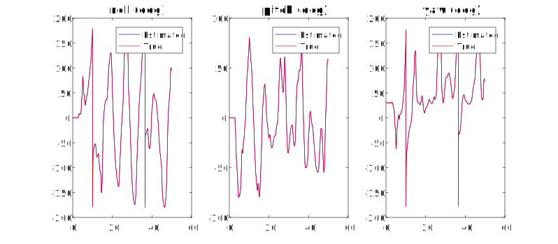
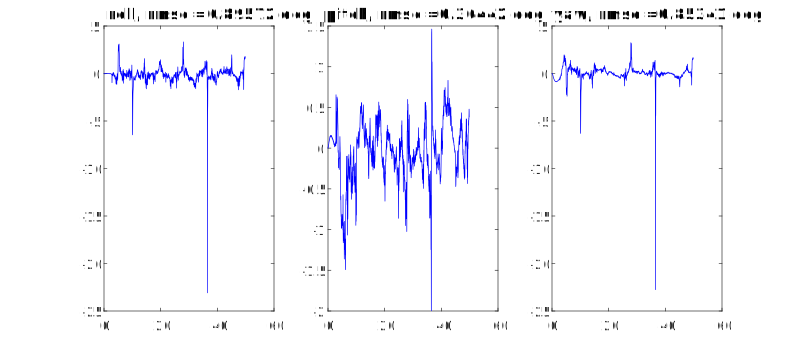

# IMU_Orientation_Estimation_by_EKF
Orientation Estimation from raw IMU data (gyroscope, accelerometer, magnetometer) using EKF, implemented in Matlab.

## Summary
This work is part of my final project in the course Optimal Control, taught by Dr. Hao Vinh-Nguyen.

## Results

  

  

