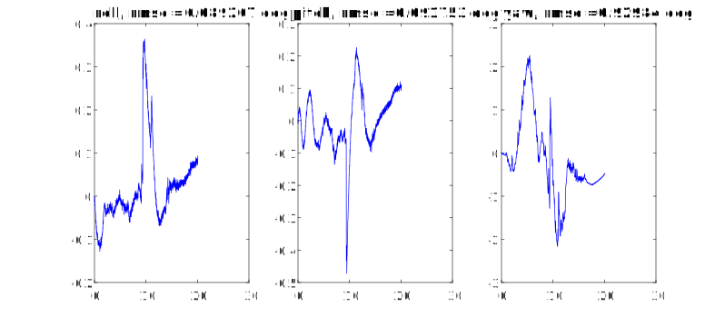

# IMU_Orientation_Estimation_by_EKF
Orientation Estimation from raw IMU data (gyroscope, accelerometer, magnetometer) using EKF, implemented in Matlab.

## Summary
This work is part of my final project in the course Optimal Control, taught by Dr. Hao Vinh-Nguyen. Glad to receive 9.5/10.0 for this quaternion-based estimator :)

## Results
free2.log

  

  

free1.log

  

  

still.log

  

  

xaxismove.log

  

  

zaxisturn.log

  

  

